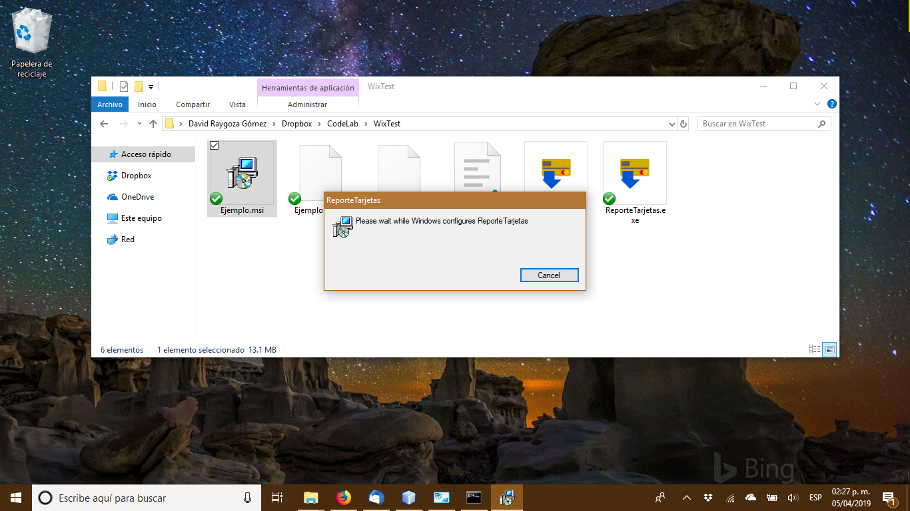
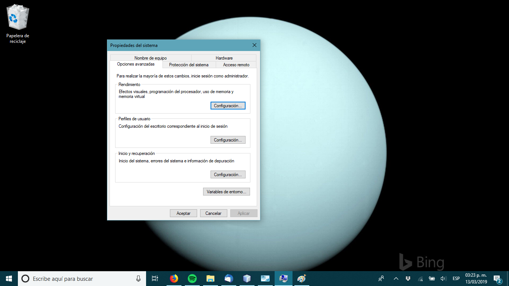
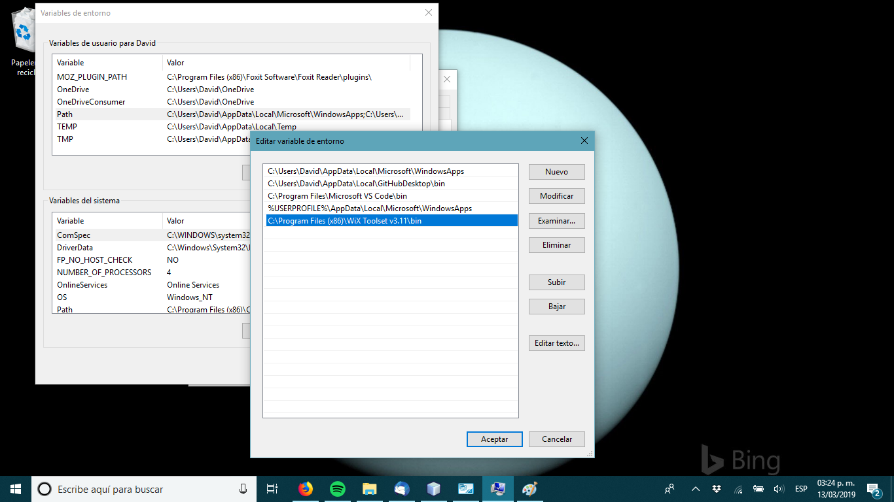
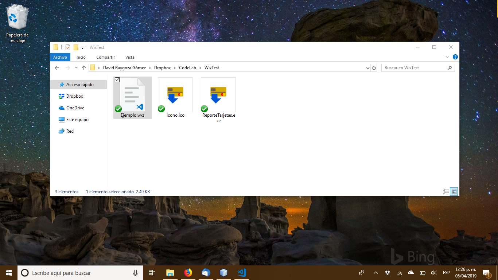
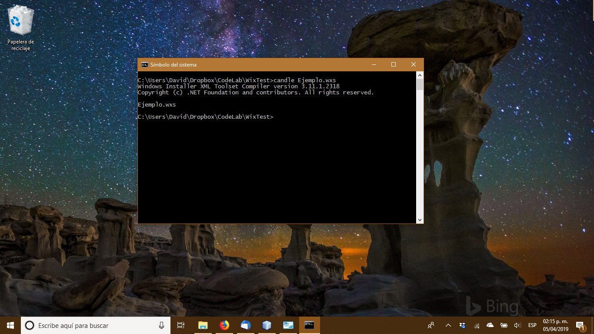
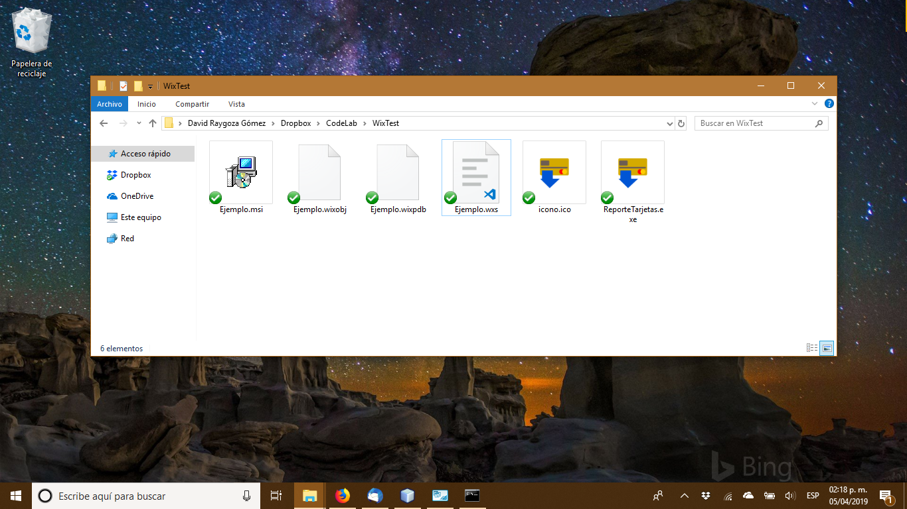
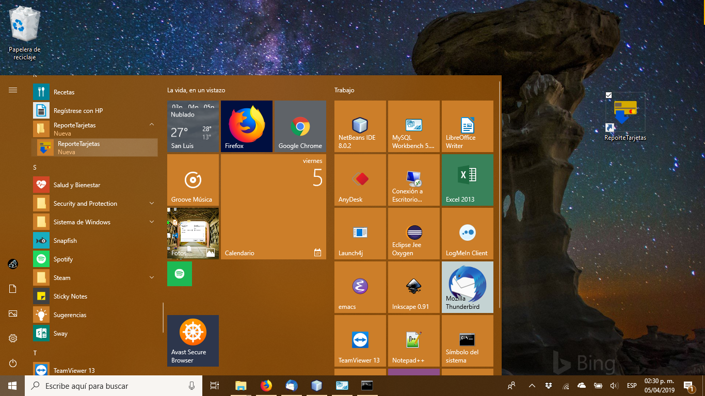
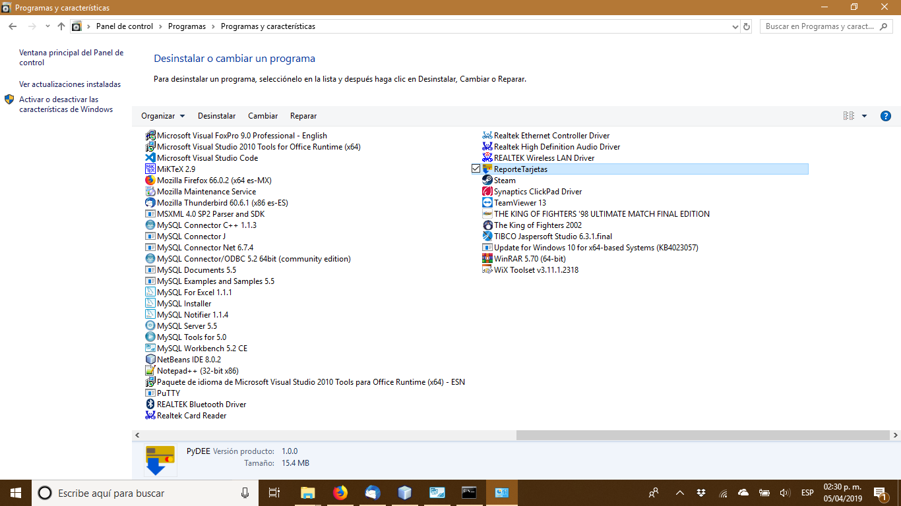

# Crear un instalador con Wix Toolset


Como parte del proceso de crear una aplicación profesional para Microsoft Windows no sera de extrañar que le pidan un programa instalador y una de las opciones para crearlo es Wix Toolset.

## Wix Toolset
Es un conjunto de herramientas de la linea de comandos que le permite crear un instalador el cual con la simplicidad de un clic agregara su programa al sistema y le dejara desinstalarlo desde el panel de control.

## Funcionamiento
La forma de operación de Wix Toolset es sencilla, vía un archivo WSX se especifica que ejecutable y recursos hay que instalar, la versión, el identificador para el sistema, el icono que el sistema usara para ese programa, preparativos de instalación e indicaciones para desinstalar.

Ya que tenga todos los archivos listos se usan los comandos candle y light y listo, tendrá su instalador .msi con el cual podrá fácilmente distribuir, instalar y desinstalar su aplicación.

## Instalando Wix Toolset
Comencemos instalando los programas necesarios, para esto vaya a http://wixtoolset.org/releases/ y descargue la versión mas reciente, la instalación es muy simple, un sencillo dialogo donde solo ocupa dar siguiente.

Sin embargo para hacerlo practico se requiere un paso adicional, agregar esos programas al PATH de Windows de modo que estén disponibles como los demás comandos del MS-DOS.

Para hacer esto vaya a las propiedades del sistema.



Y vaya al botón Variables de Entorno, esto le mostrara el dialogo de variables del entorno de Windows, selecciona PATH y seleccione Editar.



Aqui debe agregar la ruta a la carpeta BIN de Wix Toolset, esto permite que los comandos candle y light se puedan ejecutar desde cuaquier parte del sistema, no es obligatorio pero creame que es mucho mas comodo escribir candle.exe que C:\Program Files (x86)\Wix Toolset\Bin\candle.exe.

## Requerimientos

Para crear nuestro instalador vamos a necesitar 4 cosas.

* El archivo ejecutable que deseamos instalar
* El icono que queremos aparezca en formato .ico
* Un identificador GUID para el programa
* Un identificador GUID para identificar ese programa en el menú de inicio
* Un archivo WSX con la información para crear el instalador

El GUID es un identificador para que el sistema pueda identificar nuestro programa independientemente de actualizaciones o localización, este valor debe de ser único e irrepetible, hay varios recursos para generarlo pero le puedo recomendar https://www.guidgenerator.com/

El archivo WSX es un archivo XML que contiene la información que WIX Toolset usa para generar el instalador, este se describe con mas detalle en la siguiente sección.

## Archivo WSX
Este archivo es la parte principal del uso de Wix Toolset, es un archivo XML que describe le instalador, los archivos a instalar y los identificadores de cada parte del instalador.

Aquí un aviso, normalmente me gusta hacer estos tutoriales hasta que tengo una idea bastante clara de como funciona lo que sea de lo que estemos hablando, sin embargo aquí debo admitir que la documentación de Wix Toolset requiere un conocimiento mas completo de la terminología y funcionamiento de Win32 de lo que tengo y la verdad con lo poco que vi se puede hacer bastante, así que iremos con un archivo ejemplo del que solo moveremos lo necesario, lo demás se los debo para otra entrada :P.

El archivo plantilla que me a funcionado es el siguiente:
```xml
<?xml version="1.0" encoding="UTF-8"?>
<Wix xmlns="http://schemas.microsoft.com/wix/2006/wi">
  <!-- Datos del programa a instalar -->
  <Product Name="<NOMBRE PROGRAMA>" Manufacturer="<NOMBRE EMPRESA>" Id="<GUID>" UpgradeCode="<GUID>" Language="1033" Codepage="1252" Version="1.0.0">
    <!-- Detalles sobre el instalador -->
    <Package Id="*" Keywords="Installer" Description="<DESCRIPCION INSTALADOR>" Comments="<COMENTARIO INSTALADOR>" Manufacturer="<NOMBRE EMPRESA>" InstallerVersion="100" Languages="1033" Compressed="yes" SummaryCodepage="1252" />
    <!-- Crea el medio de instalación y aplica compresion-->
    <Media Id="1" Cabinet="Sample.cab" EmbedCab="yes" />
    <Directory Id="TARGETDIR" Name="SourceDir">
      <Directory Id="ProgramFilesFolder" Name="PFiles">
        <Directory Id="<ID DIRECTORIO INSTALACION>" Name="<NOMBRE DIRECTORIO>">
          <Directory Id="INSTALLDIR" Name="<DIRECTORIO PARA LA APLICACION>">
            <Component Id="MainExecutable" Guid="<GUID>">
              <File Id="<ID DE EJECUTABLE>" Name="<NOMBRE EJECUTABLE>" DiskId="1" Source="<ARCHIVO EJECUTABLE>" KeyPath="yes">
                <Shortcut Id="startmenuFoobar10" Directory="ProgramMenuDir" Name="<NOMBRE MENU INICIO>" WorkingDirectory="INSTALLDIR" Icon="IconoApp.exe" IconIndex="0" Advertise="yes" />
                <Shortcut Id="AccesoDirecto" Directory="DesktopFolder" Name="<NOMBRE ACCESO DIRECTO>" WorkingDirectory="INSTALLDIR" Icon="IconoApp.exe" IconIndex="0" Advertise="yes" />
              </File>
            </Component>
          </Directory>
        </Directory>
      </Directory>
      <Directory Id="ProgramMenuFolder" Name="Programs">
        <Directory Id="ProgramMenuDir" Name="<NOMBRE DIRECTORIO MENU DE INICIO>">
          <Component Id="ProgramMenuDir" Guid="<GUID PARA EL MENU DEL PROGRAMA EN INICIO>">
            <RemoveFolder Id="ProgramMenuDir" On="uninstall" />
            <RegistryValue Root="HKCU" Key="Software\[Manufacturer]\[ProductName]" Type="string" Value="" KeyPath="yes" />
          </Component>
        </Directory>
      </Directory>
      <Directory Id="DesktopFolder" Name="Desktop" />
    </Directory>
    <Feature Id="Complete" Level="1">
      <ComponentRef Id="MainExecutable" />
      <ComponentRef Id="ProgramMenuDir" />
    </Feature>
    <!-- Definimos un icono -->
    <Icon Id="IconoApp.exe" SourceFile="<ARCHIVO PARA ICONO DEL PROGRAM>" />
    <!-- Icono que se mostrara en el panel de control -->
    <Property Id="ARPPRODUCTICON" Value="IconoApp.exe" />
  </Product>
</Wix>
```
Como mencione un tanto rebuscado en este archivo, los elementos entre < > con nombres en mayúsculas son los que debe rellenar para indicar el nombre de su empresa, del programa, el nombre que desea aparezca en el menú de inicio, el nombre del directorio en Archivos de programa, del directorio de esa aplicación en especifico, el nombre del acceso directo, el guid de la aplicación y del menú y el icono que se usara.

Muy importante, solo ocupa generar dos GUIDs y el que va a usar para el programa es el que se usa siempre, excepto para lo de GUID PARA EL MENU DEL PROGRAMA EN INICIO, no olvide eso o saldrán errores en el siguiente paso.

## Creando instalador
Ya que halla puesto la información en el archivo vaya a ese directorio desde la consola y use el comandos candle pasandole como argumento el nombre del archivo WSX, esto le generara un archivo .wixobj si todo sale bien o le notificara de errores en su archivo si hay alguno



Si todo salió bien y tiene el archivo .wixobj ahora use el comando light para generar su instalador .msi, este comando puede tardar un par de minutos dependiendo del tamaño de su archivo ejecutable.


Hecho esto obtendrá en ese directorio su instalador .msi



## Instalando
Ok ¿Y funciona?, bueno de clic en el instalador..


Y vera que después del proceso de instalación su programa aparece tanto en el menú de inicio como en el escritorio



Ahora seguro dirá que ese es un truco viejo, que igual lo hacia con accesos directos, pero ¿Que tal hacer que aparezca en la lista de programas del panel de control?, ¿Puede hacer eso con accesos directos? por que este instalador si puede.



Y si, desde ahí se puede desinstalar sin problemas.

Y esto no es todo lo que se puede hacer ya que Wix Toolset nos proporciona herramientas para actualizar ese programa e incluso inicializar bases de datos al instalar, cosas que veremos mas adelante ;).
